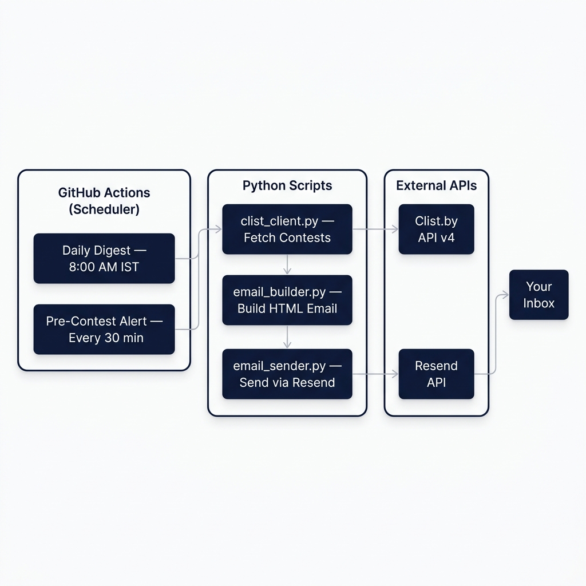

# Contest Alert System

Automated email notifications for upcoming **rated** Codeforces and CodeChef contests, delivered in **IST (UTC+5:30)**.

## Features

- **Daily Digest** at 8:00 AM IST — all rated contests for the day
- **Pre-Contest Alert** — email ~3 hours before each contest starts
- Covers **Codeforces** and **CodeChef** (rated contests only)
- All times converted to **IST** (UTC+5:30)
- **100% free** — Clist.by free tier + Resend free tier + GitHub Actions

## Architecture



## Project Structure

```
├── .github/workflows/
│   ├── daily_digest.yml          # Cron: 8:00 AM IST daily
│   └── pre_contest_alert.yml    # Cron: every 30 minutes
├── src/
│   ├── __init__.py
│   ├── config.py                 # Configuration constants
│   ├── clist_client.py           # Clist.by API client
│   ├── email_builder.py          # HTML email templates
│   └── email_sender.py           # Resend email sender
├── daily_digest.py               # Entry point: morning digest
├── pre_contest_alert.py          # Entry point: 3-hour alert
├── requirements.txt
├── .env.example
├── .gitignore
└── README.md
```

## Setup

### Prerequisites

| Service | Sign Up | Free Tier |
|---------|---------|-----------|
| **Clist.by** | [clist.by](https://clist.by) | 10 API requests/min |
| **Resend** | [resend.com](https://resend.com) | 3,000 emails/month |
| **GitHub** | [github.com](https://github.com) | Unlimited Actions (public repos) |

### Step 1: Get Your API Keys

1. **Clist.by**: Sign up → Go to API settings → Copy your `username` and `api_key`
2. **Resend**: Sign up → Dashboard → API Keys → Create a new key (starts with `re_`)

### Step 2: Push This Repo to GitHub

```bash
git init
git add .
git commit -m "Initial commit: contest alert system"
git branch -M main
git remote add origin https://github.com/modi-meet/codeforces_automation.git
git push -u origin main
```

### Step 3: Add GitHub Secrets

Go to your GitHub repo → **Settings** → **Secrets and variables** → **Actions** → **New repository secret**

Add these **4 secrets**:

| Secret Name | Value | Example |
|-------------|-------|---------|
| `CLIST_USERNAME` | Your Clist.by username | `meetmodi` |
| `CLIST_API_KEY` | Your Clist.by API key | `abc123def456...` |
| `RESEND_API_KEY` | Your Resend API key | `re_xxxxxxxxxxxx` |
| `RECIPIENT_EMAIL` | Your email address* | `mail.modimeet@gmail.com` |

> **Important**: When using Resend's free `onboarding@resend.dev` sender, the `RECIPIENT_EMAIL` **must be the same email you signed up with** on Resend.

### Step 4: Enable GitHub Actions

1. Go to your repo → **Actions** tab
2. If prompted, click **"I understand my workflows, go ahead and enable them"**
3. The workflows will automatically run on schedule!

### Step 5: Test It

1. Go to **Actions** → **Daily Contest Digest** → **Run workflow** → **Run**
2. Check your email inbox within ~1 minute

## Local Development

```bash
# Clone the repo
git clone https://github.com/modi-meet/codeforces_automation.git
cd codeforces_automation

# Install dependencies
pip install -r requirements.txt

# Set up environment variables
cp .env.example .env
# Edit .env with your actual API keys and email

# Load environment variables
export $(grep -v '^#' .env | grep -v '^$' | xargs)

# Run the daily digest
python daily_digest.py

# Run the pre-contest alert
python pre_contest_alert.py

# Send a test alert email (with mock data)
python pre_contest_alert.py --test
```

## How It Works

### Daily Digest (8:00 AM IST)

Runs once daily. Fetches all **rated** contests starting today (midnight to midnight IST), builds a styled HTML digest email, and sends it via Resend. On days with no contests, sends a brief "No contests today" notification so you know the system is working.

### Pre-Contest Alert (Every 30 minutes)

Checks if any rated contest starts in the window **[now + 2h45m, now + 3h15m]**. If a contest is found, sends an urgent-styled alert email. If the window is empty, exits silently (no spam).

> **Why 2h45m – 3h15m?** The cron runs every 30 minutes, so this ±15 minute window around the 3-hour mark ensures:
> - No contest is ever missed
> - No duplicate alerts are sent
> - GitHub Actions cron delays (~5-10 min) are absorbed

### Rated Contest Filtering

- **Codeforces**: Excludes contests with "Unrated" in the name
- **CodeChef**: All short contests (Starters, Cook-Off, Lunchtime) are rated by default

## Email Preview

The system sends two types of styled HTML emails:

| Email Type | When | Style |
|-----------|------|-------|
| **Daily Digest** | 8:00 AM IST daily | Purple/indigo header, card-based layout |
| **Pre-Contest Alert** | ~3h before contest | Red/orange urgent header, single card |

Each contest card includes:
- Platform badge (blue for Codeforces, orange for CodeChef)
- Contest name
- **Large, bold start time in IST**
- Color-coded countdown badge (green >6h, yellow 2-6h, red <2h)
- Duration and end time
- Direct "Open Contest" link

## Configuration

All configuration is in [`src/config.py`](src/config.py). Key settings:

| Setting | Default | Description |
|---------|---------|-------------|
| `IST` | UTC+5:30 | Timezone for all displayed times |
| `ALERT_WINDOW_CENTER` | 180 min | Pre-alert timing (3 hours) |
| `ALERT_WINDOW_TOLERANCE` | 15 min | Window tolerance (±15 min) |
| `RESOURCE_IDS` | 1, 2 | Codeforces + CodeChef platform IDs |

## License

MIT
